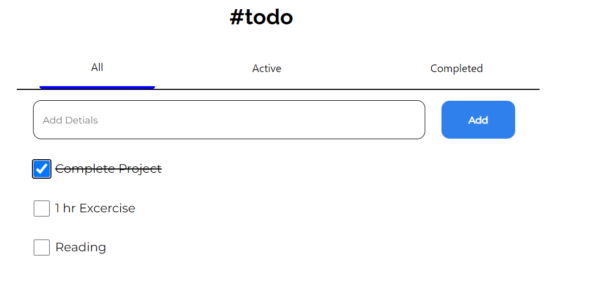
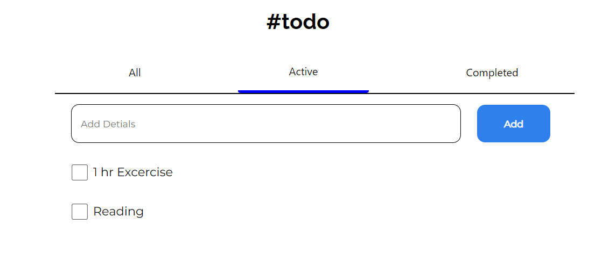
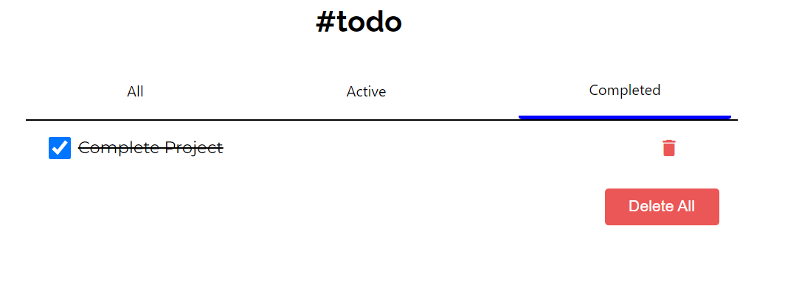

<!-- Please update value in the {}  -->

<h1 align="center">Windbnb</h1>

<a href="https://devchallenges.io/challenges/hH6PbOHBdPm6otzw2De5">Challenge</a>

<!-- TABLE OF CONTENTS -->

## Table of Contents

- [Overview](#overview)
- [Built With](#built-with)
- [Features](#features)
- [Contact](#contact)

<!-- OVERVIEW -->

## Overview





- Web application built to help users manage their tasks and to-do lists effectively
- built as a part of Dev challege

### Built With

- The project is built using React, a popular JavaScript library for building user interfaces. State management is achieved using React's built-in state and props mechanism. CSS is used to style the components and ensure a visually appealing user interface.

## Features

- Task Creation: Users can create new tasks by providing details.
- Task Completion: Users can mark tasks as completed by checking the checkbox next to the task.
- Task Deletion: Completed tasks can be deleted by clicking the delete icon.
- Task Filtering: Users can filter tasks based on their completion status using the "All," "Active," and "Completed" options.

This site was created as a submission to a [DevChallenges](https://devchallenges.io/challenges) challenge. The [challenge](https://devchallenges.io/challenges/hH6PbOHBdPm6otzw2De5) was to build an application to complete the given user stories.

## How To Use

<!-- This is an example, please update according to your application -->

To clone and run this application, you'll need [Git](https://git-scm.com) and [Node.js](https://nodejs.org/en/download/) (which comes with [npm](http://npmjs.com)) installed on your computer. From your command line:

```bash
# Clone this repository
$ git clone [https://github.com/Ibrahim-Payak/windbnb]

# Install dependencies
$ npm install

# Run the app
$ npm start
```

## Contact

- GitHub [@IbrahimPayak](https://github.com/Ibrahim-Payak)
- LinkedIn [@IbrahimPayak](https://www.linkedin.com/in/ibrahim-payak-6b8445174/)
